<style>
.small-code pre code {
  font-size: 1 em;
}
.reveal small {
  position: absolute;
  bottom: 0;
  font-size: 50%;
}
.reveal .slides{
    width: 90% !important;  
    height: 90% !important;
}
.reveal p{
  line-height: 1.5 !important;
}
.reveal code{
  background-color: #F8F8F8;
  color: #1E90FF;
}
.reveal code.bad {
  color: #B73239;
  background-color: #F4F4F4;
}
.reveal pre code {
  white-space: pre;
  overflow: auto;
  color: #00008B;
}
</style>

Lecture 7 - NGS & File Formats
========================================================
author: Simon Coetzee
date: 02/20/2024
width: 1440
height: 900
transition: fade
font-import: https://fonts.googleapis.com/css?family=Roboto
font-family: 'Roboto'


<small>
"NGS & File Formats" is licensed under [CC BY](https://creativecommons.org/licenses/by/4.0/) by Simon Coetzee.</small>
</small>


========================================================
type: sub-section
<center>

</center>

Before We Begin
========================================================
type: sub-section
### Unix Magic
The poster, by Gary Overacre - drawn in 1986, features a white bearded wizard with UNIX related objects around him, for example a spool of thread, a boot, a fork, pipes, and a bunch of containers labeled troff, awk, diff, uucp, make, null, and there’s even a C container and cracked B container.


Goals
========================================================

- Understanding NGS file formats

Goals
========================================================

- Understanding NGS file formats

- Understanding NGS quality assessment

FASTA
========================================================

- FASTA format reports a sequence

FASTA
========================================================

- FASTA format reports a sequence

- Can contain protein sequences or nucleic acid sequences

FASTA
========================================================

- FASTA format reports a sequence

- Can contain protein sequences or nucleic acid sequences

- Common applications include
  - Reference Genome
  - Gene Sequences

FASTA
========================================================

- FASTA format reports a sequence

- Can contain protein sequences or nucleic acid sequences

- Common applications include
  - Reference Genome - [GRCh38](ftp://ftp.ebi.ac.uk/pub/databases/gencode/Gencode_human/release_34/GRCh38.primary_assembly.genome.fa.gz)
  - Gene Sequences - Gencode [transcript sequences](ftp://ftp.ebi.ac.uk/pub/databases/gencode/Gencode_human/release_34/gencode.v34.transcripts.fa.gz) and [transcript translation sequences](ftp://ftp.ebi.ac.uk/pub/databases/gencode/Gencode_human/release_34/gencode.v34.pc_translations.fa.gz)


FASTA
========================================================

- Starts with a sequence header, and follows with the sequence itself

<center>
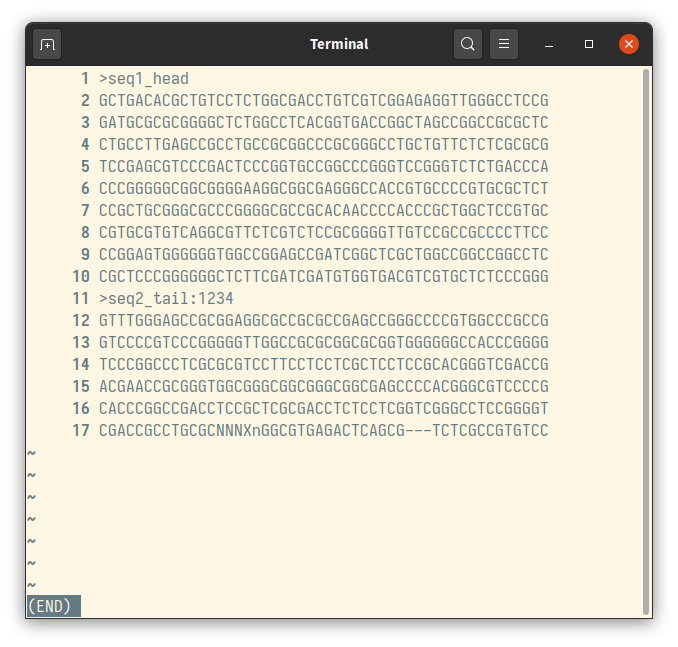
</center>

FASTA
========================================================

- Starts with a sequence header, and follows with the sequence itself

<center>
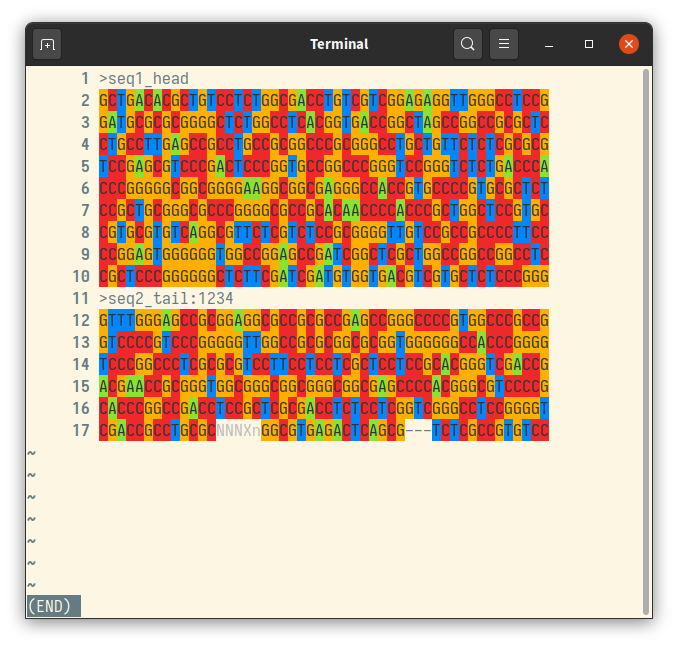
</center>

FASTQ
========================================================

- Very widely used
- Delivered from the sequencer

FASTQ
========================================================

- Very widely used
- Delivered from the sequencer
- Similar to FASTA
  - Different header format
  - Includes quality scores
- Entry to Alignment / QC

FASTQ
========================================================

Nearly everything works with this format. Some common examples are:

- Aligners
  - Bowtie, Tophat2
- Assemblers
  - Velvet, Spades
- QC tools
  - Trimmomatic, FastQC

FASTQ
========================================================

- Four lines per entry
  - Sequence Header
      - @ to whitespace = sequence identifier
      - whitespace to line end = sequence description
  - Sequence
  - +
  - Quality Scores
  
FASTQ
========================================================

- Four lines per entry

<center>
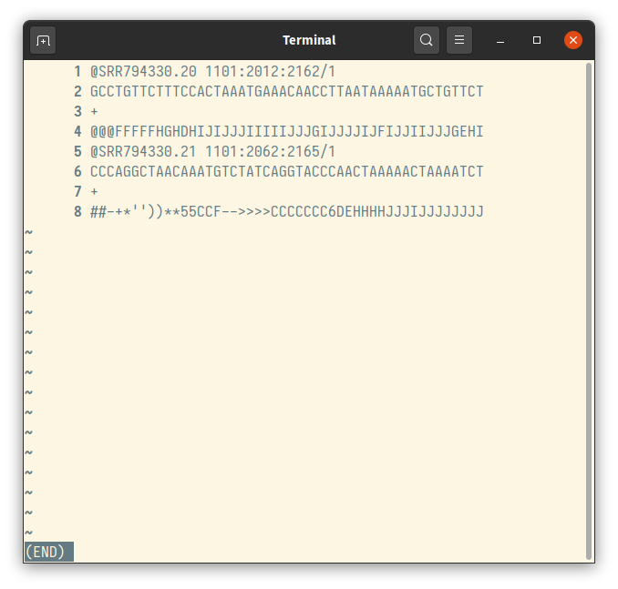
</center>

FASTQ
========================================================

- Four lines per entry

<center>
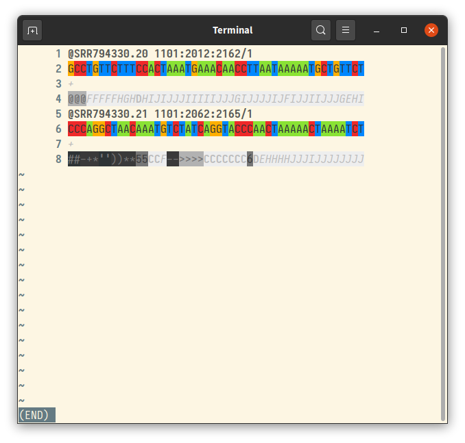
</center>

FASTQ
========================================================

*Header:*

@EAS139:136:FC706VJ:2:2104:15343:197393 1:Y:18:ATCACG

|entry | description |
|:-:|:-:|
|EAS139 	|the unique instrument name|
|136 	|the run id|
|FC706VJ 	|the flowcell id|
|2 	|flowcell lane|
|2104 	|tile number within the flowcell lane|
|15343 	|'x'-coordinate of the cluster within the tile|
|197393 	|'y'-coordinate of the cluster within the tile|
|1 	|the member of a pair, 1 or 2 (paired-end or mate-pair reads only)|
|Y 	|Y if the read is filtered (did not pass), N otherwise|
|18 	|0 when none of the control bits are on, otherwise it is an even number|
|ATCACG 	|index sequence |

FASTQ
========================================================

- Quality Scores
  - Score is 0 - 40, represented by ASCII sequences. Primarily with an offset of 33

<center>


https://en.wikipedia.org/wiki/ASCII
</center>

FASTQ
========================================================

We can translate from the table below from a symbol to a hexidecimal value, and then in our linux terminal to a decimal value.

Hexadecimal is just base 16

`0, 1, 2, 3, 4, 5, 6, 7, 8, 9, A, B, C, D, E, F, 10, ..., 19, 1A, 1B, ...`

We can see that `+` is equivalent to `2B` in hexadecimal. So to convert to decimal, and subtract the offset of `33`, we enter the following command which indicates that 2B is a hexadecimal number `16#2B` and subtracts 33 from it.

```
$ echo $(( 16#2B - 33 ))
10
```

<center>

</center>

FASTQ
========================================================

- Quality Scores
  - Score is 0 - 40, represented by ASCII sequences. Primarily with an offset of 33
  - Q = $-10 \log_{10} P$
  - P = $10 ^ {-Q/10}$

common question "how many reads have an average phred quality score > 30?"

<center>


|Phred quality score (Q)   |Probability of incorrect call (P)   |Base call accuracy   |
|:-:|:-:|:-:|
|10   |1 in 10   |90%   |
|20   |1 in 100   |99%   |
|30   |1 in 1000   |99.9%   |
|40   |1 in 10000   |99.99%   |
|50   |1 in 100000   |99.999%   |
</center>

FASTQC
========================================================
[Good Illumina Data](https://www.bioinformatics.babraham.ac.uk/projects/fastqc/good_sequence_short_fastqc.html)

[Bad Illumina Data](https://www.bioinformatics.babraham.ac.uk/projects/fastqc/bad_sequence_fastqc.html)

[FASTQC Help](https://www.bioinformatics.babraham.ac.uk/projects/fastqc/Help/)

<center>
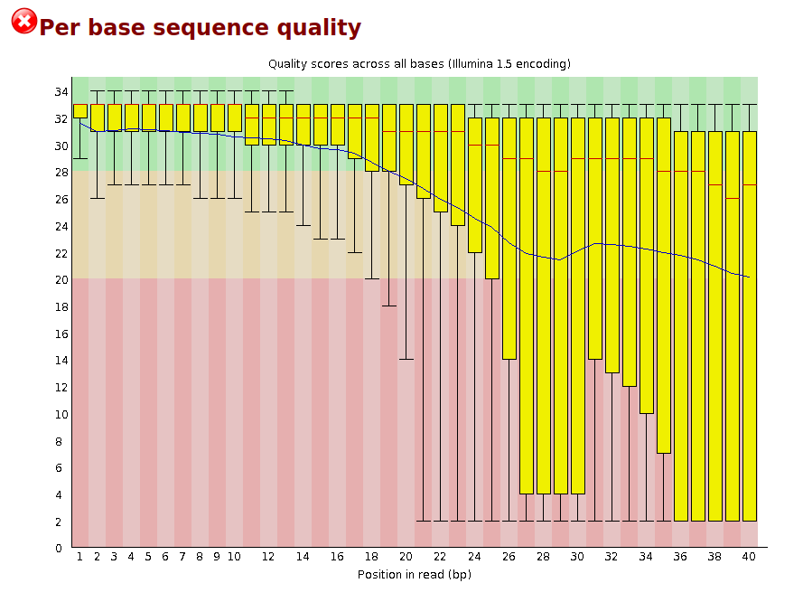
</center>

FASTQC
========================================================
Raw Data QC:
  * identify sequencing problems.
  * identify contaminating sequences.
  * gain insight into library complexity.

FASTQC
========================================================
Raw Data QC:
  * identify sequencing problems.
    * check quality of base calls.
    * examine the reads to ensure quality matches expectations.
    * check for contamination.

FASTQC
========================================================
*Things to check for:* (problems with sequencing)

Poor Quality across the sequence.

Drop in quality unexpectedly (e.g. in the middle)

Large Percentage of sequence with low quality scores.

FASTQC
========================================================
*Things to check for:* 

* Biased sequence composition
   * Could be due to contaminating sequence (mitochondrial RNA, rRNA, adapters)

* High level of sequence duplications
  * Low complexity library - too much PCR not enought starting material.
  * Not always a problem at this stage of QC (post alignment QC will inform)

* Over-represented sequences
  * Again - adapters, contamination, vectors

FASTQC
========================================================
*Can we ID degraded RNA-Seq samples at this stage?*

FASTQC
========================================================
*Can we ID degraded RNA-Seq samples at this stage?*

No, degraded samples usually just have generally sorter RNA molecules, 
the quality of the sequenced nucleotides will be fine.

SAM / BAM / CRAM
========================================================
Sequence Alignment Map (SAM)

SAM / BAM / CRAM
========================================================
Sequence Alignment Map (SAM)
 - Standardizes how alignments are reported
    - Alignment
    
SAM / BAM / CRAM
========================================================
Sequence Alignment Map (SAM)
 - Standardizes how alignments are reported
    - Alignment
    - Quality Scores (mapping + base quality)
    
SAM / BAM / CRAM
========================================================
Sequence Alignment Map (SAM)
 - Standardizes how alignments are reported
    - Alignment
    - Quality Scores (mapping + base quality)
    - The original reads from the FASTQ
    
SAM / BAM / CRAM
========================================================
Sequence Alignment Map (SAM)
 - Standardizes how alignments are reported
    - Alignment
    - Quality Scores (mapping + base quality)
    - The original reads from the FASTQ
    - Paired end information

BAM - compressed searchable binary SAM

CRAM - even smaller compressed searchable binary SAM

SAM / BAM / CRAM
========================================================
Sequence Alignment Map (SAM)

Fully Described in a [specification](https://samtools.github.io/hts-specs/SAMv1.pdf)

Complex header - many optional fields
Some include:
  - command that generated the SAM file
  - SAM format version
  - sequencer name and version


SAM / BAM / CRAM
========================================================
Sequence Alignment Map (SAM)

Fully Described in a [specification](https://samtools.github.io/hts-specs/SAMv1.pdf)

Complex header - many optional fields

Each header line begins with the character `@` followed by one of the two-letter header record type codes.

In the header, each line is TAB-delimited and, apart from `@CO` lines, each data field follows a format `TAG:VALUE` where TAG is a two-character string that defines the format and content of VALUE.


========================================================

<center>
Example of the first few fields of the SAM header

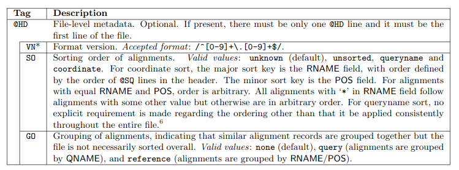
</center>

    @HD The header line. The first line if present.
        VN* Format version. Accepted format: /^[0-9]+.[0-9]+$/.
    @SQ Reference sequence dictionary. The order of @SQ lines defines the alignment sorting order.
        SN* Reference sequence name. The SN tags and all individual AN names in all @SQ lines must be distinct. The value of this field is used in the alignment records in RNAME and RNEXT fields. Regular expression: [:rname:∧ =][:rname:]
        LN* Reference sequence length. Range: [1, 2 31 − 1]
    @RG Read group. Unordered multiple @RG lines are allowed.
        ID* Read group identifier. Each @RG line must have a unique ID. The value of ID is used in the RG tags of alignment records. Must be unique among all read groups in header section. Read group IDs may be modified when merging SAM files in order to handle collisions.


SAM / BAM / CRAM
========================================================
Where is it used?

- Alignment algorithms
- Some assemblers
- CRAM/unaligned BAM (uBAM) can be a source of data delivery in some institutions: this cuts down significantly on storage space and transfer speed.
- Alignment viewers
- Variant detection algorithms


SAM / BAM / CRAM
========================================================
Sequence Alignment Map (SAM)

<center>

</center>

SAM / BAM / CRAM
========================================================
11 mandatory fields

<center>

</center>

SAM / BAM / CRAM
========================================================
Flags can tell you about each read, and allow for summaries on the file, and filtering.

[Explain SAM flags website](https://broadinstitute.github.io/picard/explain-flags.html)

<center>
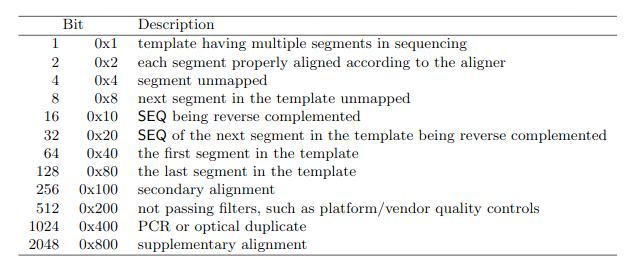
</center>

SAM / BAM / CRAM
========================================================
Flags can tell you about each read, and allow for summaries on the file, and filtering.

<center>
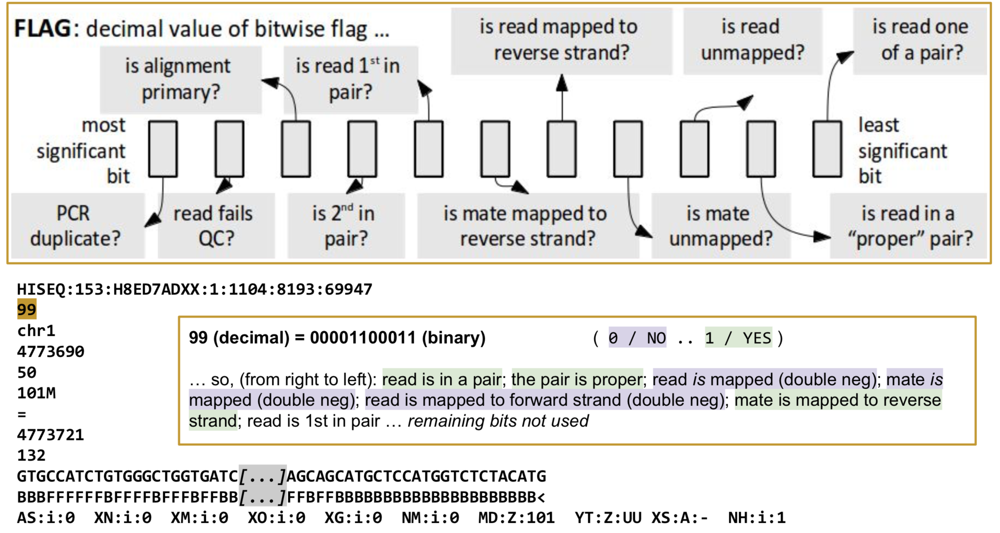
</center>

SAM / BAM / CRAM
========================================================
Flags can tell you about each read, and allow for summaries on the file, and filtering.

The appropriate tool can easily manipulate BAM files.

i.e., [samtools](http://www.htslib.org/), [picard](https://broadinstitute.github.io/picard/)

`samtools flagstat file.bam`
<center>
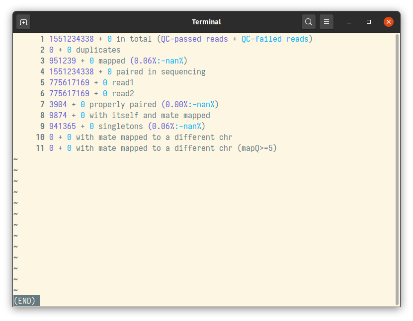
</center>

SAM / BAM / CRAM
========================================================
MAPQ can encode the Mapping Quality

$-10 log_{10} Pr \{mapping\ position\ is\ wrong\}$

255 indicates no mapping quality is available

<center>

</center>

SAM / BAM / CRAM
========================================================
CIGAR can encode the alignment

Compact Idiosyncratic Gapped Alignment Report

<center>
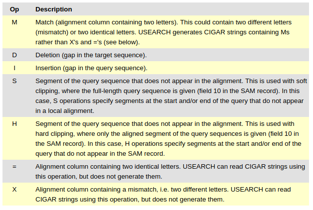
</center>

SAM / BAM / CRAM
========================================================
CIGAR can encode the alignment

<center>

</center>

SAM / BAM / CRAM
========================================================
CIGAR can encode the alignment

<center>
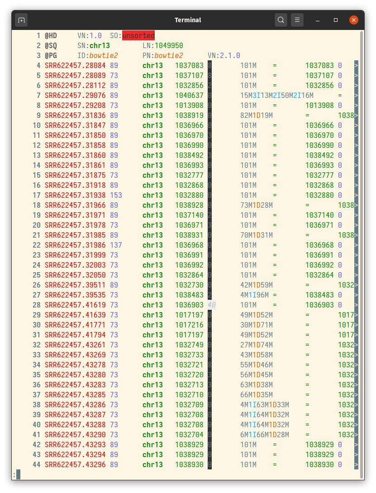
</center>

SAM / BAM / CRAM
========================================================
CIGAR can encode the alignment

<center>
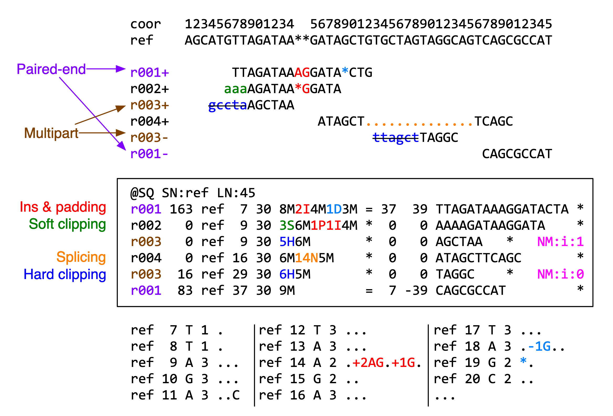
</center>


BED
========================================================
BED (Browser Extensible Data)

Simple format to describe intervals on the genome


BED
========================================================
Simple format to describe intervals on the genome

Basic form is 3 columns

 - Chromosome Name
 - Chromosome Start
 - Chromosome End

BED
========================================================
 - Chromosome Name
 - Chromosome Start
 - Chromosome End

start is 0 based

end is 1 based

the first 100 bases on chromosome 1 would be represented with

`chr1  0      100`

and the next 100 bases

`chr1  100    200`

BED
========================================================
 - Chromosome Name
 - Chromosome Start
 - Chromosome End
 
Optional Fields:

Name, Score, Strand, thickStart, thickEnd, itemRgb, blockCount, blockSizes, blockStarts

BED
========================================================
Optional Fields

Name, Score, Strand, thickStart, thickEnd, itemRgb, blockCount, blockSizes, blockStarts

<center>
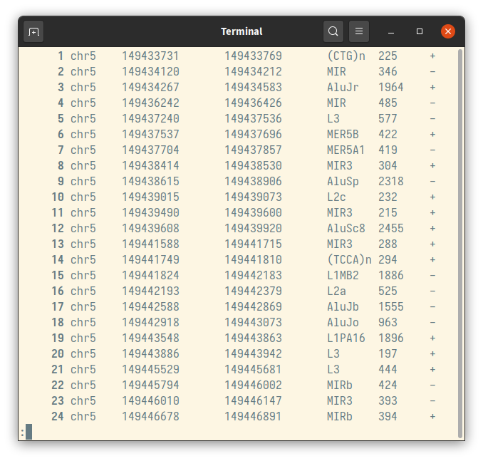
</center>

BED
========================================================
Optional Fields

Name, Score, Strand, thickStart, thickEnd, itemRgb, blockCount, blockSizes, blockStarts

<center>
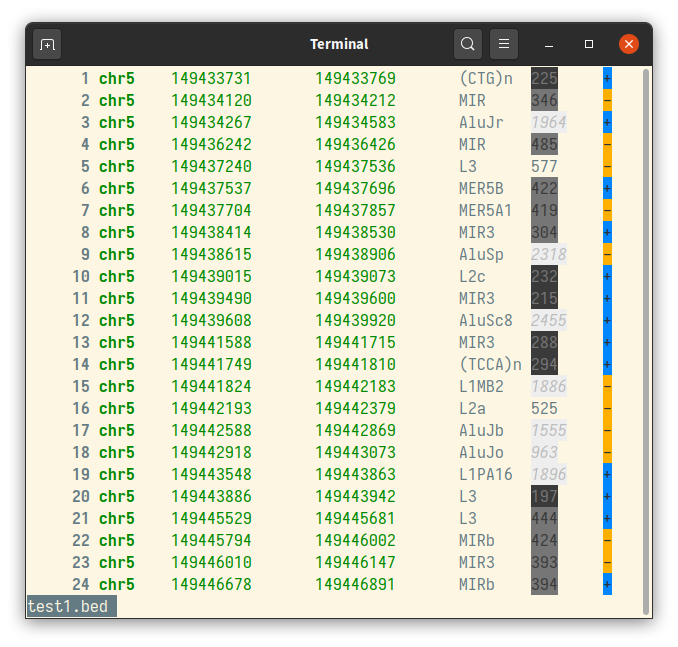
</center>

BED
========================================================
Optional Fields

Name, Score, Strand, thickStart, thickEnd, itemRgb, blockCount, blockSizes, blockStarts

<center>
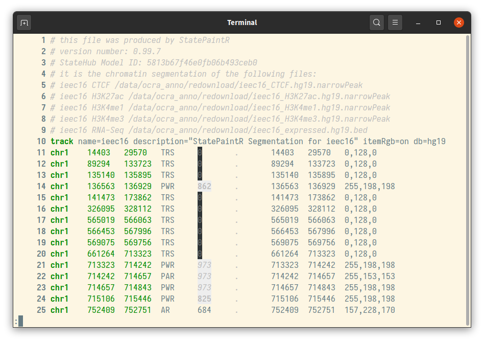
</center>

BED
========================================================
What software use bed files?

- Alignment viewers can use these data to graphically display certain features.
- [bedtools](http://bedtools.readthedocs.io/en/latest/index.html) uses this format to query for nearby features.
- Some annotation files are in this format.
- Feature detection packages use this as output. i.e. StatePaintR


BED
========================================================
Many additional derivitives, many from ENCODE

[narrowPeak](https://genome.ucsc.edu/FAQ/FAQformat.html#format12)

[broadPeak](https://genome.ucsc.edu/FAQ/FAQformat.html#format13)

[gappedPeak](https://genome.ucsc.edu/FAQ/FAQformat.html#format14)

etc

<center>
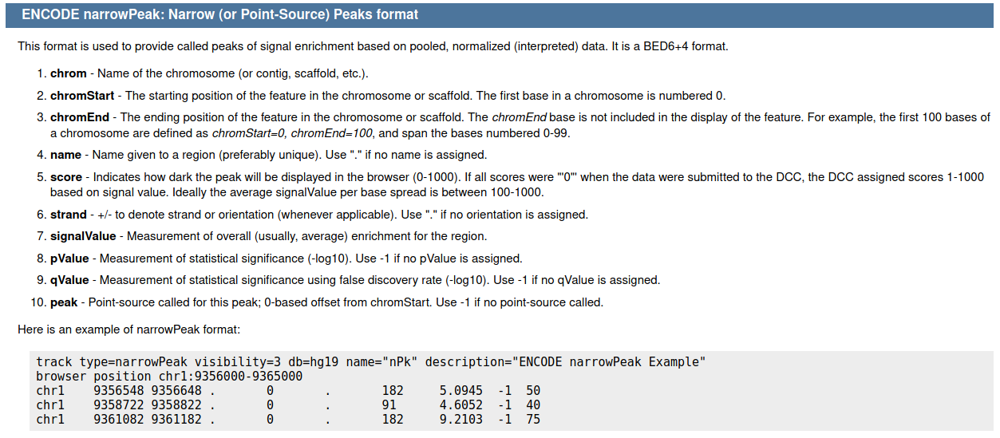
</center>


GTF
========================================================
GTF (Gene Transfer Format)

Mostly used to describe Genes.

GTF
========================================================
GTF (Gene Transfer Format)

Mostly used to describe Genes.

First 8 fields are required:

1. seqname - like chromosome name
2. source - the program that generated the feature
3. feature - some standard names include 5UTR, CDS, exon, transcript
4. start - starts at 1 this time `¯\_(ツ)_/¯`
5. end
6. score
7. strand
8. frame

GTF
========================================================
GTF (Gene Transfer Format)

Mostly used to describe Genes.

First 8 fields are required:

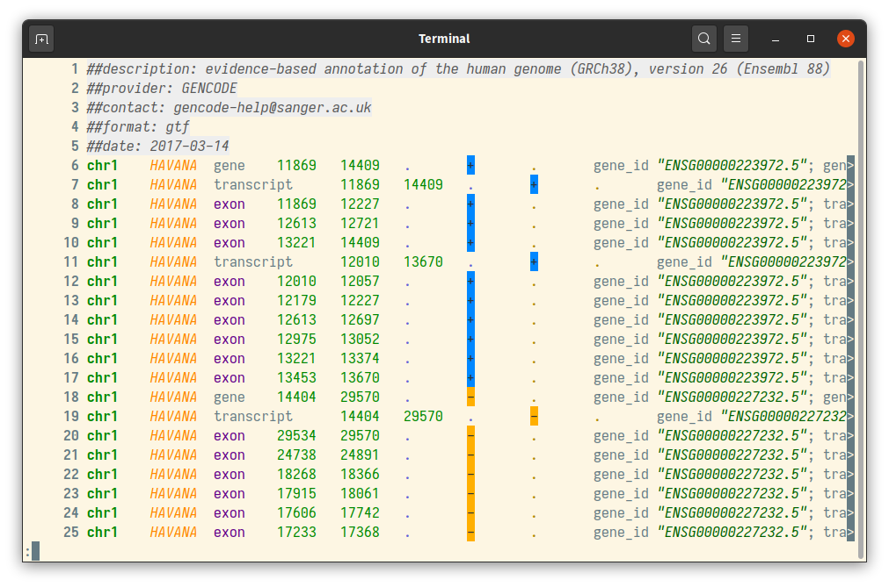

GTF
========================================================

9th column

**Required:**

gene_id "ENSG00000227232.5"; 
transcript_id "ENST00000488147.1"; 

**Optional:**

gene_type "unprocessed_pseudogene"; 
gene_name "WASH7P"; 

transcript_type "unprocessed_pseudogene"; 
transcript_name "WASH7P-001"; 

exon_number 11; 
exon_id "ENSE00001843071.1"; 

level 2; 
transcript_support_level "NA"; 

ont "PGO:0000005"; 
tag "basic"; 

havana_gene "OTTHUMG00000000958.1"; 
havana_transcript "OTTHUMT00000002839.1";

GTF
========================================================

What uses GTF?

Any tool that requires information about gene position for analysis such as:
- Mapping RNA-seq such as [Salmon](https://combine-lab.github.io/salmon/), [Kallisto](https://pachterlab.github.io/kallisto/), [HISAT2](http://daehwankimlab.github.io/hisat2/)
- Counting feature abundance, like [featureCounts](http://bioinf.wehi.edu.au/featureCounts/), [HTSeq](https://htseq.readthedocs.io/en/master/)
- Genome Browsers like [IGV](http://software.broadinstitute.org/software/igv/), [UCSC](https://genome.ucsc.edu/)

<center>
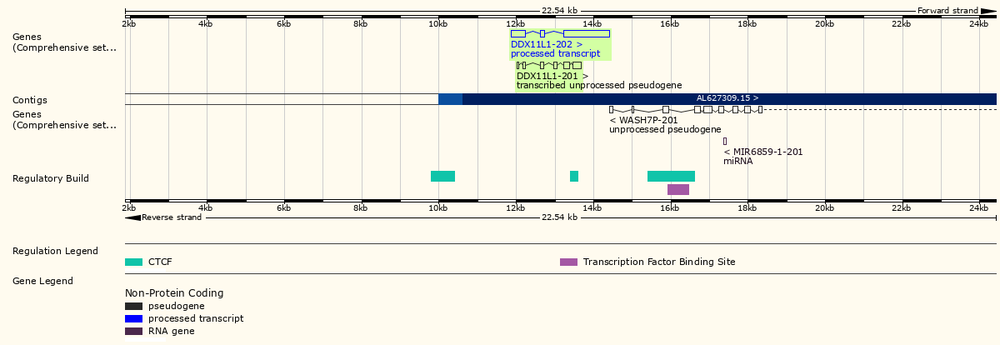
</center>

VCF
========================================================
VCF (Variant Calling Format)

Describes SNVs and INDELs


VCF
========================================================
VCF (Variant Calling Format)

Describes SNVs and INDELs
 - Single Nucleotide Variants, like SNPs and point mutations
 - Insertions, deletions, other sequence variations


VCF
========================================================
VCF (Variant Calling Format)

Another complex format, but has an [official specification](http://samtools.github.io/hts-specs/VCFv4.1.pdf)

8 required Fields

<center>
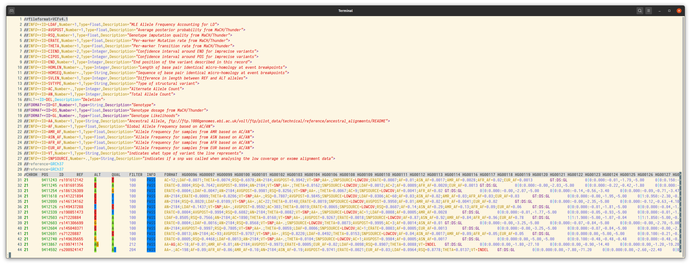
</center>


VCF
========================================================
VCF (Variant Calling Format)

8 required Fields:

1. Chromosome Name
2. Position
3. ID
4. Reference base(s)
5. Alternate base(s)
6. Variant Quality
7. Filter
8. Info

VCF
========================================================
VCF (Variant Calling Format)

8 required Fields:

<center>
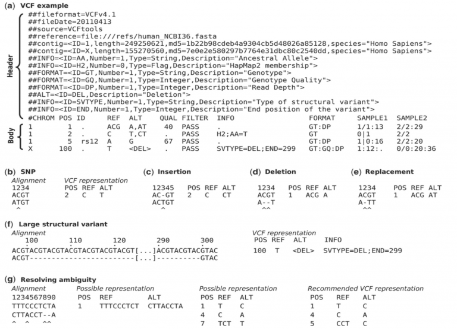
</center>


VCF
========================================================
VCF (Variant Calling Format)

What uses VCF?
- Output of SNP detection tools such as [GATK](https://software.broadinstitute.org/gatk/) and [Samtools](http://samtools.github.io/)
- Input for SNP feature detection like [SNPeff](http://snpeff.sourceforge.net/)
- [VCF Tools](https://vcftools.github.io/index.html)
- Also the required format for [dbSNP](https://www.ncbi.nlm.nih.gov/projects/SNP/)


